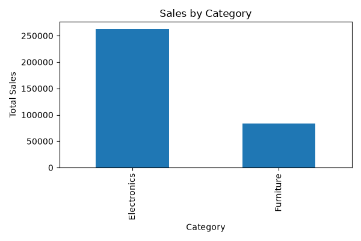
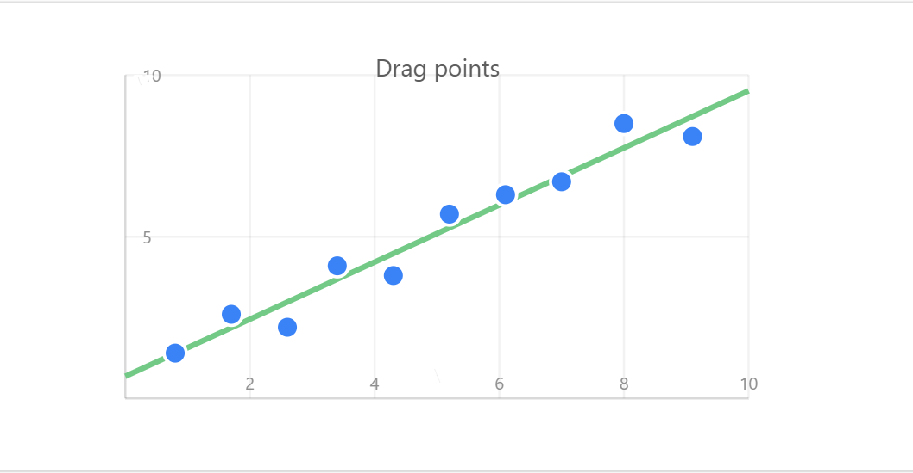

# Exploratory Data Analysis (EDA) Project

## Project Description

This project analyzes sales data using Python. Statistical summaries and visualizations are used to identify trends, correlations, and business insights.

## Technologies Used

- Python
- Pandas
- Matplotlib
- Seaborn
- VS Code

## Features

- Statistical Summary
- Missing Value Analysis
- Sales Trend Analysis
- Correlation Analysis
- Data Visualization

## Output Screenshots

### Sales by Category

### Correlation Heatmap

## Project Files

- sales_data.csv
- eda_analysis.py
- sales_bar_chart.png
- correlation_heatmap.png
- Project_Report.pdf

## Author

Priyadharshini E
